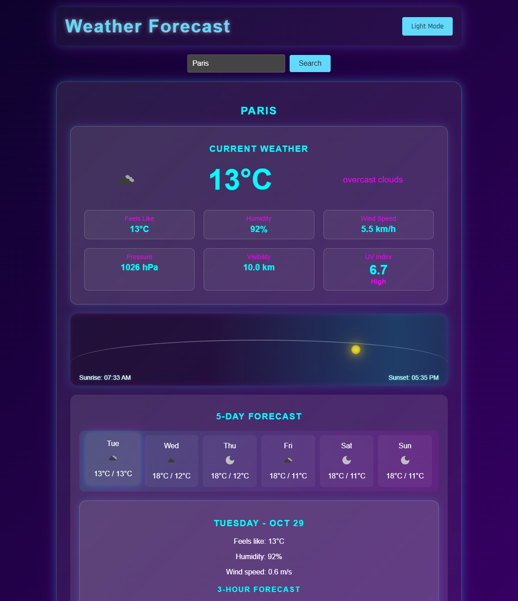

# Cyber Weather App

A modern, cyberpunk-themed weather application built with React that provides current weather conditions and forecasts.

?? [Live Demo](https://drfuturo.github.io/Cyber-Weather-app)

## Features

- ??? Real-time weather data display
- ?? Location-based weather detection
- ?? City search functionality
- ?? Dark/Light mode toggle
- ?? Responsive design
- ?? Cyberpunk-inspired UI
- ?? Detailed weather information including:
  - Temperature
  - Humidity
  - Wind speed
  - UV Index
  - Sunrise/Sunset times
  - 5-day forecast
  - Hourly forecast
- ?? Random city display when no location is provided

## Technologies Used

- React.js
- OpenWeatherMap API
- CSS3 with custom animations
- GitHub Pages for deployment

## Installation

1. Clone the repository:
git clone https://github.com/DrFuturo/Cyber-Weather-app.git

2. Navigate to the project directory:
cd Cyber-Weather-app

3. Install dependencies:
npm install

4. Create a \.env\ file in the root directory and add your OpenWeatherMap API key:
REACT_APP_OPENWEATHERMAP_API_KEY=your_api_key_here

5. Start the development server:
npm start

## Usage

- Allow location access for automatic local weather display
- Use the search bar to look up weather in any city
- Toggle between dark and light modes using the button in the top right
- Click on different days in the forecast to see detailed information
- Scroll through hourly forecasts for more detailed timing

## Styling

The app features a cyberpunk aesthetic with:
- Neon color accents
- Glassmorphic UI elements
- Custom weather icons
- Animated gradients
- Responsive layout
- Interactive hover effects

## API Integration

This app uses the OpenWeatherMap API to fetch:
- Current weather conditions
- 5-day weather forecast
- Hourly forecast data
- UV index information
- Sunrise and sunset times

## Contributing

1. Fork the repository
2. Create your feature branch (\git checkout -b feature/AmazingFeature\)
3. Commit your changes (\git commit -m 'Add some AmazingFeature'\)
4. Push to the branch (\git push origin feature/AmazingFeature\)
5. Open a Pull Request

## License

This project is licensed under the MIT License - see the [LICENSE.md](LICENSE.md) file for details

## Acknowledgments

- Weather data provided by [OpenWeatherMap](https://openweathermap.org/)
- Icons and design inspiration from various cyberpunk sources
- React.js community for excellent documentation and support

## Contact

Your Name - [@YourTwitter](https://twitter.com/yourtwitter)

Project Link: [https://github.com/DrFuturo/Cyber-Weather-app](https://github.com/DrFuturo/Cyber-Weather-app)
